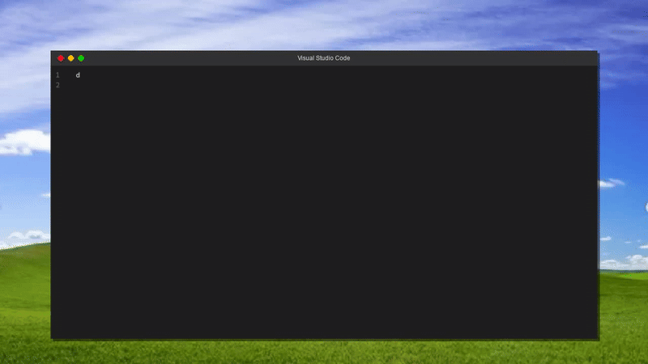

# VSCode Typing Simulator

A Python application that creates a video simulation of code being typed in a Visual Studio Code-like interface, complete with a Windows XP-style background.

## Features

- Simulates typing code in a VSCode-like interface
- Windows XP-style desktop background
- Realistic window chrome with title bar and control buttons
- Line numbers
- Customizable typing speed
- Outputs to AVI video format

## Requirements

- Python 3.9+
- OpenCV (4.8.0)
- NumPy (1.24.0)
- Pygame (2.5.0)

## Installation

1. Create a virtual environment and activate it:
```bash
python -m venv env
source env/bin/activate  # On Windows use: env\Scripts\activate
```

2. Install dependencies:
```bash
pip install -r requirements.txt
```

## Usage

1. Place your Python source file in the project directory
2. Run the script:
```bash
python capture.py
```

3. Follow the prompts:
   - Enter the source file name (including .py extension)
   - Enter the output file name (without extension)
   - Enter the recording duration in seconds

4. Wait for the process to complete. The output will be saved as an AVI video file.

## Example

You can test the application with the included example file:
```bash
python capture.py
```
Then enter:
- Source file: `test.py`
- Output file: `demo`
- Duration: `10`

This will create a video showing the typing of a simple "Hello World" program.

## Project Structure

```
.
├── capture.py          # Main script for video recording
├── vscode_mockup.py    # VSCode interface simulator
├── test.py            # Example Python file
├── media/             # Assets directory
│   ├── CascadiaCode.ttf           # VSCode font
│   └── windows-xp-wallpaper.jpeg  # Background image
├── requirements.txt    # Project dependencies
└── README.md          # Documentation
```

## Configuration

You can modify the following parameters in the code:

- Window size: Change `width` and `height` in VSCodeMockup class (default: 1280x720)
- Typing speed: Modify `delay` parameter in simulate_typing method (default: 0.1s)
- Font size: Adjust font size in VSCodeMockup class (default: 14px)
- Window margins and dimensions in the VSCodeMockup class

## Contributing

1. Fork the repository
2. Create your feature branch (`git checkout -b feature/AmazingFeature`)
3. Commit your changes (`git commit -m 'Add some AmazingFeature'`)
4. Push to the branch (`git push origin feature/AmazingFeature`)
5. Open a Pull Request

## License

This project is licensed under the MIT License - see the LICENSE file for details.

## Acknowledgments

- Visual Studio Code for inspiration
- Microsoft Windows XP for the nostalgic background
- Cascadia Code font by Microsoft